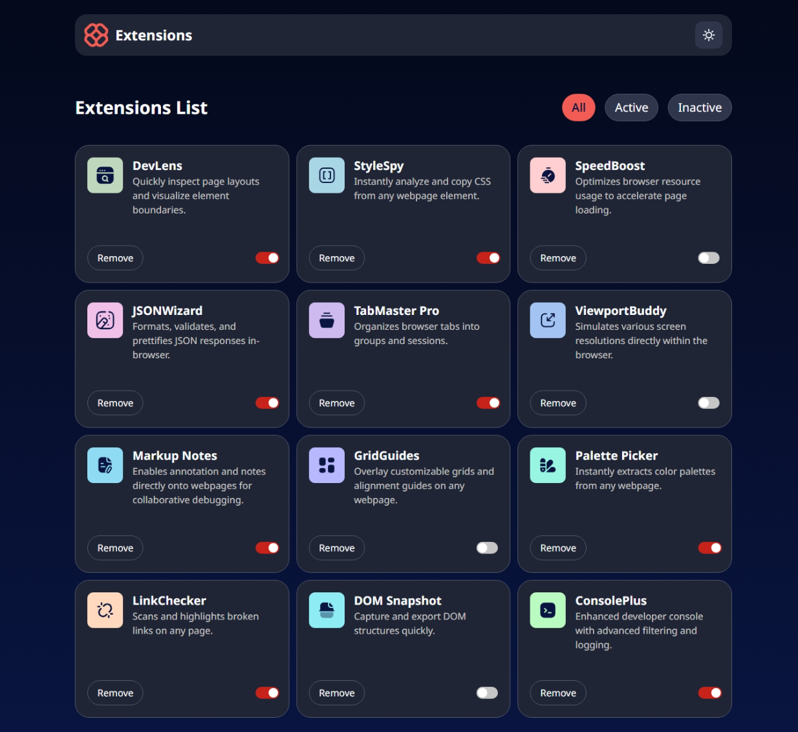

# Browser Extension Manager UI

This project is a solution to the **Browser Extension Manager UI Challenge**.  
Built with **Next.js** and **Tailwind CSS**, the goal was to replicate the given design as closely as possible while implementing key functionalities like toggling, filtering, removing extensions, and theme selection.

## ✨ Features

- Toggle extensions between active and inactive states
- Filter extensions by active/inactive status
- Remove extensions from the list
- Switch between light and dark themes
- Responsive layout adapting to different screen sizes
- Hover and focus states for all interactive elements
- Data dynamically loaded from a local `data.json` file

## 🔗 Solution

[View Solution Repository]() 

## 🚀 Live Demo

[View Live Site](https://browser-extensions-manager-ui-snowy.vercel.app/) <!-- replace '#' with your deployed site link -->

## 📸 Preview

 <!-- replace '#' with the screenshot image link -->

---

## 🛠️ Built With

- [Next.js](https://nextjs.org/)
- [Tailwind CSS](https://tailwindcss.com/)
- [Vercel](https://vercel.com/) (for deployment)

---

## Getting Started

To run the project locally:

```bash
# Clone the repository
git clone <repository-url>

# Navigate into the project directory
cd browser-extension-manager-ui

# Install dependencies
npm install

# Run the development server
npm run dev
```

Open [http://localhost:3000](http://localhost:3000) with your browser to see the result.
